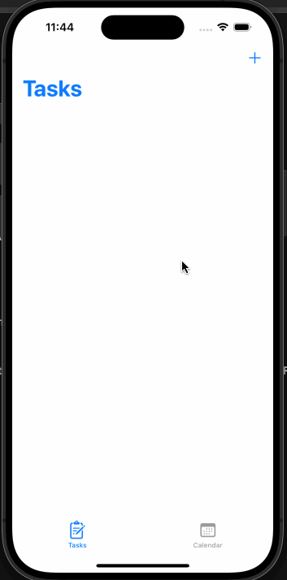

# Project 7 - *tasks app*

Submitted by: **Cecilia Truong**

**tasks app** is an app that lets you add tasks and keep track of them.

Time spent: **2** hours spent in total

## Required Features

The following **required** functionality is completed:

- [x] App displays a list of tasks
- [x] Users can add tasks to the list
- [x] Session persists when application is closed and relaunched (tasks dont get deleted when closing app) 
  - [x] Note: You have to quit the app, not minimize it, in order to see the persistence.
- [x] Tasks can be deleted
- [x] Users have a calendar view via navigation controller that displays tasks	

The following **additional** features are implemented:

- [x] Tasks can be toggled completed
- [x] User can edit tasks by tapping on the task in the feed view
- [ ] List anything else that you can get done to improve the app functionality!

## Video Walkthrough

## Notes

I had trouble with my tasks duplicating whenever I toggled its completion, but I fixed it. 

## License

    Copyright [yyyy] [name of copyright owner]

    Licensed under the Apache License, Version 2.0 (the "License");
    you may not use this file except in compliance with the License.
    You may obtain a copy of the License at

        http://www.apache.org/licenses/LICENSE-2.0

    Unless required by applicable law or agreed to in writing, software
    distributed under the License is distributed on an "AS IS" BASIS,
    WITHOUT WARRANTIES OR CONDITIONS OF ANY KIND, either express or implied.
    See the License for the specific language governing permissions and
    limitations under the License.
